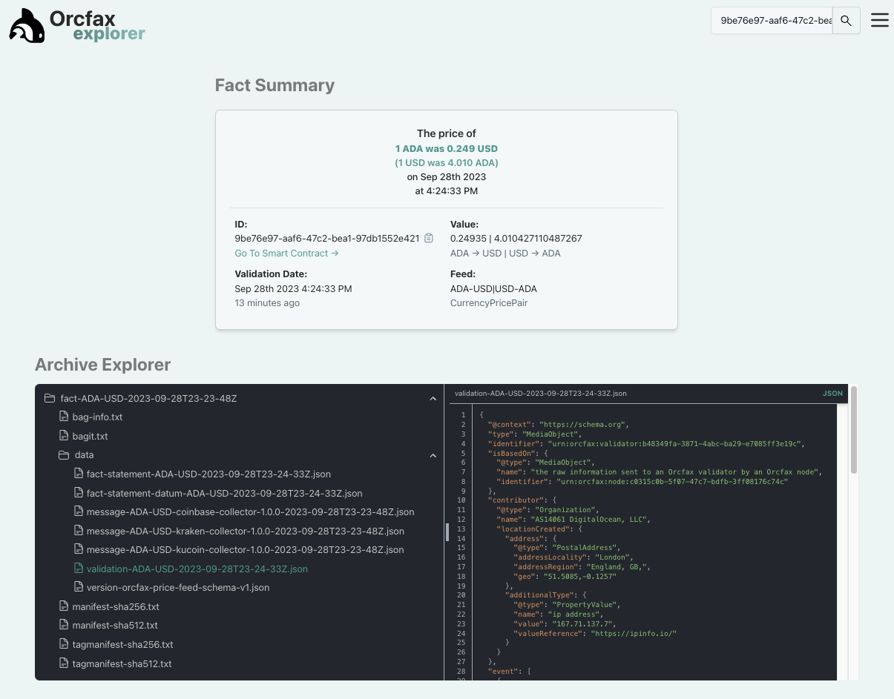

# Orcfax Datum Demo

This repo contains a demonstration Python script
[`read_datum.py`](read_datum.py) that will read an on-chain Orcfax Datum using PyCardano.

This example reads an on-chain Datum via our PreProd Testnet [Ogmios][ogmios-1] server. It converts the Cardano transaction's CBOR serialization to human and machine-readable JSON and then logs various details about the Datum as it goes.

This script will work out of the box using the Developer Install instructions
below. It connects to the Orcfax Preprod smart contract address for our
`ADA-USD|USD-ADA` feed.

[ogmios-1]: https://ogmios.dev/

## Example output

PyCardano makes it easy to tweak the configuration in
[`read_datum.py`](read_datum.py) to experiment with your own outputs and give
you ideas on how to incorporate our decentralized oracle price feed data in your
own dApps. When you're ready, you can point it at your own Mainnet Ogmios
server.

The current version of this script outputs as follows:

<!-- markdownlint-disable-line-length MD013 -->
```text
2023-09-28T16:24:13Z INFO :: read_datum.py:264:read_datum() :: entering this script...
2023-09-28T16:24:13Z INFO :: read_datum.py:265:read_datum() :: oracle smart contract: addr_test1wrtcecfy7np3sduzn99ffuv8qx2sa8v977l0xql8ca7lgkgmktuc0
2023-09-28T16:24:15Z INFO :: read_datum.py:226:get_latest_utxo() :: inspecting '862' UTxOs
2023-09-28T16:24:15Z WARNING :: read_datum.py:254:get_latest_utxo() :: '7.00' hours since datum was published (1695943470811)
2023-09-28T16:24:15Z INFO :: read_datum.py:191:validate_utxo() :: inspecting the utxo for valid auth tokens
2023-09-28T16:24:15Z INFO :: read_datum.py:217:validate_utxo() :: the utxo is valid, it contains the correct auth token
2023-09-28T16:24:15Z INFO :: read_datum.py:79:display_utxo() :: (input) transaction id: 078d548b0ed91b95164d0baaf2b486161e06aab84483d99ed01a2180090ab0f3
2023-09-28T16:24:15Z INFO :: read_datum.py:80:display_utxo() :: (output) transaction addr: addr_test1wrtcecfy7np3sduzn99ffuv8qx2sa8v977l0xql8ca7lgkgmktuc0
2023-09-28T16:24:15Z INFO :: read_datum.py:81:display_utxo() :: (output) datum cbor:

590207d8799fa74840636f6e746578745268747470733a2f2f736368656d612e6f7267525f3a636f6e74656e745369676e61747572655840343033333066663235393763333939646461616162366331646261616235323137336566383262663766303864336361383435383561623565373634323961304a6964656e746966696572a34a70726f706572747949445041726b6c79204964656e74696669657244747970654d50726f706572747956616c75654576616c7565582f75726e3a6f72636661783a34616531303634302d313062392d346332332d616631642d633461396462643839333864446e616d654f4144412d5553447c5553442d41444144747970654d50726f706572747956616c75654576616c75659fd87c9f1a0003ce971bfffffffffffffffaffd87c9f1b000e3d57a771924e1bfffffffffffffff1ffff4e76616c75655265666572656e63659fa34540747970654d50726f706572747956616c7565446e616d654976616c696446726f6d4576616c75651b0000018adde4c05ba34540747970654d50726f706572747956616c7565446e616d654c76616c69645468726f7567684576616c75651b0000018ade1baedbff5820303443413030303148424559394b4b34343950314345513850483744544a5954d87a9f1b0000018ade1baedbff581c90b121aa6b689200adf7ed115040a96375d2b68e23633d6864c53a91ff

2023-09-28T16:24:15Z INFO :: read_datum.py:84:display_utxo() :: (output) Tx cost: 3.42214 ADA
2023-09-28T16:24:15Z INFO :: read_datum.py:151:decode_utxo() ::

{
  "@context": "https://schema.org",
  "type": "PropertyValue",
  "name": "ADA-USD|USD-ADA",
  "value": [
    0.249495,
    4.008096354636367
  ],
  "valueReference": [
    {
      "@type": "PropertyValue",
      "name": "validFrom",
      "value": 1695939870811
    },
    {
      "@type": "PropertyValue",
      "name": "validThrough",
      "value": 1695943470811
    }
  ],
  "identifier": {
    "propertyID": "Arkly Identifier",
    "type": "PropertyValue",
    "value": "urn:orcfax:4ae10640-10b9-4c23-af1d-c4a9dbd8938d"
  },
  "_:contentSignature": "40330ff2597c399ddaaab6c1dbaab52173ef82bf7f08d3ca84585ab5e76429a0"
}

2023-09-28T16:24:15Z INFO :: read_datum.py:152:decode_utxo() :: oracle datum identifier (internal): b'04CA0001HBEY9KK449P1CEQ8PH7DTJYT'
2023-09-28T16:24:15Z INFO :: read_datum.py:157:decode_utxo() :: oracle datum timestamp: 2023-09-28T23:24:30Z (1695943470811)
2023-09-28T16:24:15Z INFO :: read_datum.py:170:pretty_log_value() :: ADA-USD: 0.249495
2023-09-28T16:24:15Z INFO :: read_datum.py:170:pretty_log_value() :: USD-ADA: 4.008096354636367
```

### Deeper context

The on-chain datum that the Orcfax oracle publishes contain identifiers that
resolve to audit log packages on the decentralized
[Arweave.org](https://arweave.org) network.

```json
"identifier": {
    "propertyID": "Arkly Identifier",
    "type": "PropertyValue",
    "value": "urn:orcfax:4ae10640-10b9-4c23-af1d-c4a9dbd8938d"
```

These standards-compliant packages are prepared using the
[Arkly.io](http://arkly.io/about/) decentralized archiving platform and provide
context about the provenance, collection and validation of the Orcfax fact
statements to ensure their authenticity and accuracy.

The Orcfax project provides a convenient
[Explorer](https://explorer.orcfax.io/9be76e97-aaf6-47c2-bea1-97db1552e421) to search all the audit packages for its published Mainnet datum. They are marked
up as [Schema.org](https://schema.org/Claim) [JSON-LD](https://json-ld.org/) for
machine-readable re-use.



## Developer install

### pip

Setup a virtual environment `venv` and install the local development
requirements as follows:

```bash
python3 -m venv venv
source venv/bin/activate
python -m pip install -r requirements/local.txt
```

### tox

#### Run tests (all)

```bash
python -m tox
```

#### Run linting-only

```bash
python -m tox -e linting
```

### pre-commit

Pre-commit can be used to provide more feedback before committing code. This
reduces reduces the number of commits you might want to make when working on
code, it's also an alternative to running tox manually.

To set up pre-commit, providing `pip install` has been run above:

* `pre-commit install`

This repository contains a default number of pre-commit hooks, but there may
be others suited to different projects. A list of other pre-commit hooks can be
found [here][pre-commit-1].

[pre-commit-1]: https://pre-commit.com/hooks.html

## Run the PreProd script

```bash
python read_datum.py
```
